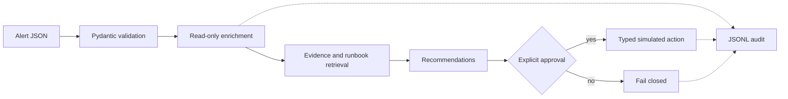

# Mini Agentic SOC Analyst

A deterministic Python 3.11 prototype for investigating a
suspicious login without allowing untrusted alert text to become instructions.
It uses Pydantic, pytest, and the standard library (apart from Pydantic).

## Architecture

```text
JSON alert -> validation -> read-only enrichment ─┐
                         -> token-overlap runbook ├-> evidence + recommendations
                         -> identity history ─────┘            |
                                                               v
                                                    typed guardrails -> audit JSONL
                                                    (approval required for impact)
```

The workflow is intentionally a normal Python call graph:
`app.investigate` -> `app.orchestrator` -> `tools.guardrails` -> explicit
`tools.registry`. No dynamic eval, arbitrary text-to-callable mapping, or LLM
is involved. The no-LLM choice keeps this prototype reproducible,
auditable, easy to test, and unable to grant a model direct tool authority. A
Mermaid view:



## Local setup

Use Python 3.11 or newer. From the repository root, verify your Python
version, then create and activate a virtual environment:

```bash
python3 --version
python3.11 -m venv .venv
source .venv/bin/activate
```

On Windows PowerShell, activate it with:

```powershell
py -3.11 -m venv .venv
.\.venv\Scripts\Activate.ps1
```

If `python3.11` is not available on macOS or Linux, use the installed
Python 3.11 executable, for example:

```bash
python3 -m venv .venv
```

Upgrade `pip` and install the project with its development dependencies:

```bash
python -m pip install --upgrade pip
python -m pip install -e ".[dev]"
```

To leave the virtual environment later, run:

```bash
deactivate
```

## Run tests

With the virtual environment activated:

```bash
pytest
```

## Demo

Run the suspicious-login investigation:

```bash
python -m app.investigate samples/suspicious_login.json
```

The CLI asks about exactly one high-impact recommendation. Enter `n` (or
anything other than `y`/`yes`) to reject safely; enter `y` to run the simulated
adapter. Every dispatch is appended to `logs/audit.jsonl`. The prompt-injection
hostname sample remains data and is never interpreted as a tool instruction:

```bash
printf 'n\n' | python -m app.investigate samples/prompt_injection_alert.json
```

## Security and design principles

- Pydantic rejects unsupported alert types, malformed IPs, naive timestamps,
  negative attempt counts, unknown fields, and malformed tool arguments.
- The registry is an explicit allowlist. Read-only tools can run automatically;
  `revoke_sessions`, `force_password_reset`, and `isolate_endpoint` are
  `HIGH_IMPACT` and require approval outside the orchestrator.
- Unknown tools, invalid arguments, and unapproved impact fail closed and are
  audited. Adapters are simulations; no remediation executes against a real
  system.
- The investigation produces evidence and recommendations, but does not
  execute remediation itself.

The YARA-L file in `detections/` is illustrative detection-as-code. The
Tekton pipeline shows checkout, dependency installation, validation, tests,
detection validation, and packaging.

## Limitations and next steps

Threat intelligence and identity data are deterministic fixtures, retrieval is
simple token overlap, and tool responses are mocked. A production version
would add real provider adapters, durable audit storage, authorization and
secret management, richer evidence correlation, and policy-based approvals.
Future improvements explicitly include a lint/type-check toolchain (for
example Ruff and mypy/pyright) and an optional local LLM for bounded
summarization or retrieval assistance, never direct tool authority.
